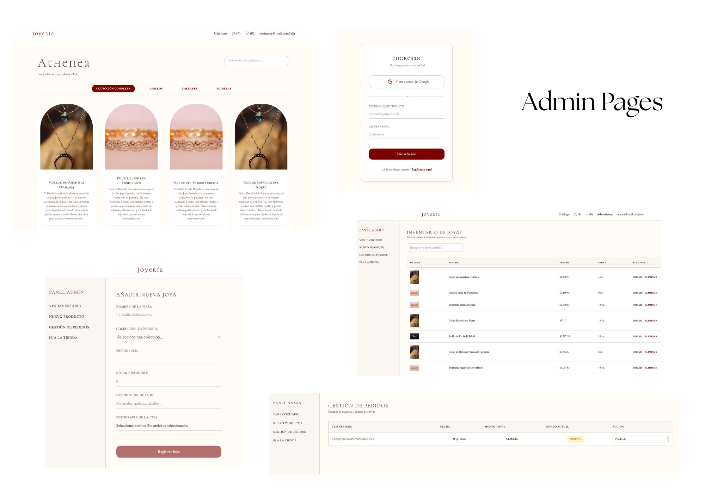

# 👑 Athenea Joyería — Plataforma E-Commerce de Alta Gama

Este proyecto es una **Single Page Application (SPA) Full Stack** de comercio electrónico especializada en joyería fina y de alta gama ("Athenea Joyería"), desarrollada como Proyecto Integrador para la especialización Frontend de Henry. La aplicación implementa arquitectura por capas, tipado estricto con TypeScript, persistencia en la nube en tiempo real, carga segura de archivos en la nube y una completa suite de pruebas automatizadas.

---
🌐 **Link de la App:** [eccomerce-app-xi.vercel.app](https://eccomerce-app-xi.vercel.app/)

## 📸 Capturas de Pantalla de la App

### 1. Admin Page


### 2. Customer Page


## 🛠️ Tecnologías y Herramientas

[](https://react.dev/)
[](https://www.typescriptlang.org/)
[](https://firebase.google.com/)
[](https://aws.amazon.com/s3/)
[](https://vite.dev/)
[](https://vitest.dev/)

---

## 👥 Roles del Sistema

| Rol | 🔑 Características & Funcionalidades |
| :--- | :--- |
| 🛍️ **Clientes (Customers)** | • Navegación por colecciones exclusivas (Anillos, Collares, Pulseras).<br>• Búsqueda inteligente interactiva con retardo (Debounce).<br>• Gestión de Lista de Deseos (Wishlist).<br>• Bolsa de compras interactiva persistente localmente.<br>• Simulación de checkout con snapshots históricos inmutables. |
| 🛡️ **Administradores (Admins)** | • Acceso exclusivo al panel de administración protegido (`/admin`).<br>• CRUD completo de productos (creación, edición y eliminación).<br>• Carga de fotografías de alta resolución en la nube (AWS S3) mediante URLs firmadas.<br>• Gestión y actualización del estado logístico de los pedidos de clientes. |

---

## 📐 Decisiones Arquitectónicas

> [!TIP]
> **Context API + useReducer (Bolsa de Compras)**
> Centraliza reglas de negocio complejas (duplicados, stock, totales monetarios) en un reductor puro. Garantiza inmutabilidad y facilita pruebas unitarias aisladas sin efectos secundarios.

> [!IMPORTANT]
> **Carga Segura de Imágenes (AWS S3 Presigned URLs)**
> Evita saturar Firestore con datos binarios pesados. Las imágenes reales de las joyas se suben directamente al bucket S3 usando enlaces pre-firmados de corta duración generados por funciones Serverless en Vercel, manteniendo las credenciales de AWS siempre seguras del lado del servidor.

> [!NOTE]
> **Arquitectura Limpia por Capas**
> • **UI/Pages:** Vistas enfocadas únicamente en la renderización visual.<br>• **Contexts:** Orquestación y propagación del estado global.<br>• **Services:** Capa pura de comunicación externa (Firebase, Vercel APIs).<br>• **Types:** Contratos y tipado estricto con TypeScript.

---

## 📂 Estructura del Proyecto

El código está organizado de manera modular bajo los principios de separación de responsabilidades:

```text
ecommerce-app/
├── api/                  # Funciones Serverless (Vercel API)
├── scripts/              # Scripts auxiliares (Seed de Base de Datos)
├── src/
│   ├── components/       # Componentes visuales organizados (Layouts y UI)
│   ├── config/           # Configuraciones clave (Firebase Client)
│   ├── contexts/         # Gestión de Estado Global (Auth, Cart, Orders, Products, Wishlist)
│   ├── hooks/            # Hooks personalizados reutilizables
│   ├── pages/            # Páginas de Clientes y de Administración
│   ├── routes/           # Rutas públicas, protegidas y privadas
│   ├── services/         # Servicios puros para APIs, Auth y Base de Datos
│   └── styles/           # Archivos CSS dedicados por vista/componente
```

---

## ⚙️ Instalación y Configuración

Despliega las siguientes pestañas para configurar el proyecto paso a paso de manera local:

<details>
<summary><b>📋 Paso 1: Clonar e Instalar dependencias</b></summary>

```bash
# Clonar el repositorio
git clone <URL_DE_TU_REPOSITORIO_AQUI>
cd ecommerce-app

# Instalar los paquetes requeridos por el sistema
npm install
```
</details>

<details>
<summary><b>🔥 Paso 2: Configuración de Firebase (Auth y Firestore)</b></summary>

1. Crea un proyecto en [Firebase Console](https://console.firebase.google.com/).
2. Habilitar **Authentication** y activa los proveedores de **Correo/Contraseña** y **Google**.
3. Habilitar **Cloud Firestore** en modo de prueba y crea dos colecciones principales: `products` y `users`.
4. Ve a la configuración de tu proyecto (icono de engranaje) y copia tus credenciales del cliente.
</details>

<details>
<summary><b>☁️ Paso 3: Configuración de AWS S3 (Bucket, CORS e IAM)</b></summary>

1. Crea un bucket nuevo en S3. Desactiva "Bloquear todo el acceso público".
2. En la pestaña **Permissions**, desplázate a **CORS** y pega la siguiente configuración para autorizar las subidas en desarrollo y producción:
```json
[
  {
    "AllowedHeaders": ["Content-Type"],
    "AllowedMethods": ["PUT"],
    "AllowedOrigins": ["*"],
    "ExposeHeaders": ["ETag"],
    "MaxAgeSeconds": 3000
  }
]
```
3. Crea un usuario IAM (`s3-uploader`) con la política `AmazonS3FullAccess`.
4. Genera sus credenciales en la pestaña de **Security credentials** (**Access Key ID** y **Secret Access Key**).
</details>

<details>
<summary><b>🔑 Paso 4: Variables de Entorno (.env)</b></summary>

Crea un archivo `.env` en la raíz de tu proyecto basándote en el archivo de plantilla `.env.example`:
```properties
# Firebase
VITE_FIREBASE_API_KEY=tu_api_key_aqui
VITE_FIREBASE_AUTH_DOMAIN=tu_auth_domain_aqui
VITE_FIREBASE_PROJECT_ID=tu_project_id_aqui
VITE_FIREBASE_STORAGE_BUCKET=tu_storage_bucket_aqui
VITE_FIREBASE_MESSAGING_SENDER_ID=tu_messaging_sender_id_aqui
VITE_FIREBASE_APP_ID=tu_app_id_aqui

# AWS S3 (Vercel Functions)
AWS_ACCESS_KEY_ID_VAL=tu_access_key_id_de_AWS_aqui
AWS_SECRET_ACCESS_KEY_VAL=tu_secret_access_key_de_AWS_aqui
AWS_REGION_NAME=us-east-1
AWS_S3_BUCKET_NAME=el_nombre_de_tu_bucket_de_S3_aqui
```
</details>

<details>
<summary><b>🌱 Paso 5: Database Seeding & Iniciar Servidor</b></summary>

```bash
# Poblar base de datos automáticamente con 60 joyas de alta calidad
npx ts-node scripts/seed.ts

# Iniciar servidor en modo de desarrollo
npm run dev
```

El servidor local se abrirá en `http://localhost:5173`.
</details>

---

## 🔒 Flujo de Carga de Imágenes (Presigned URLs)

La carga segura de archivos binarios a S3 se realiza directamente desde el navegador del administrador hacia S3, previniendo cuellos de botella y manteniendo seguras las claves secretas:

```text
[ Administrador (React) ] ──(1. Solicitar firma / POST)──> [ Servidor (Vercel Function) ]
                                                                       │
                                                          (2. Firma con credenciales AWS)
                                                                       │
[ Administrador (React) ] <──(3. Retornar URL pre-firmada)─────────────┘
          │
  (4. Sube imagen vía PUT)
          ▼
[ AWS S3 Bucket (Público) ]
          │
  (5. Guarda URL de imagen)
          ▼
[ Cloud Firestore ]
```

---

## 📝 Bitácora de Uso de IA: 5 Momentos Clave

| # | 🤖 Prompt Utilizado | 💡 Aprendizaje / Reflexión | 🛠️ Decisión Técnica |
| :---: | :--- | :--- | :--- |
| **1** | *¿Cómo estructurar mi proyecto integrador en una arquitectura de capas limpia utilizando React, TypeScript y Firebase?* | Aprendí la importancia de desacoplar los componentes visuales de React del SDK de Firebase. La UI solo debe renderizar; las llamadas externas van en la capa pura de servicios (`services/`). | Componentes e interfaces independientes. Vistas limpias y lógicas reutilizables en `products.service.ts`. |
| **2** | *Estoy teniendo un error de permisos "Missing or insufficient permissions" en Firestore al intentar verificar si mi usuario es administrador...* | Si un usuario inicia sesión pero aún no tiene perfil creado en Firestore, la regla de lectura del rol falla. Se debe comprobar primero la existencia física del perfil. | Implementación de la regla de validación de seguridad usando `exists()` de Firestore, previniendo excepciones fatales. |
| **3** | *¿Cuándo deberia usar useReducer en lugar de useState simple para un carrito de compras y cómo se asocia a Context API?* | Un carrito involucra transacciones complejas encadenadas (totales, cantidades, límites de stock). `useReducer` centraliza todo en un reductor puro libre de efectos secundarios. | Estructuración de `cartReducer` puro acoplado a almacenamiento en caché local (`localStorage`) para persistencia reactiva. |
| **4** | *¿Por qué es una mala práctica guardar solo el ID del producto en un documento de orden de compra histórica en e-commerce?* | Concepto de **Snapshot Inmutable**: los precios y nombres históricos de una compra no deben variar si el administrador edita o borra el producto original. | Copiado directo e inmutable de campos (`name` y `priceAtPurchase`) en el momento exacto del checkout de compra. |
| **5** | *Mi test de Vitest para useCart.test.ts me arroja error TS1294: 'This syntax is not allowed when erasableSyntaxOnly is enabled'...* | Cualquier archivo que contenga sintaxis o elementos JSX/TSX debe tener explícitamente la extensión `.tsx` para que el compilador no confunda los corchetes HTML con operadores. | Migración modular de archivos de prueba a `.tsx`, solucionando de forma inmediata los errores sintácticos de TypeScript. |

---

## 🧪 Pruebas Unitarias y de Integración (Vitest)

El proyecto incluye una suite estructurada de pruebas automáticas con **Vitest** y **React Testing Library**:

*   `cart.reducer.test.ts`: Pruebas de lógica pura (Inmutabilidad, vaciado y cantidades de la bolsa).
*   `useCart.test.tsx`: Pruebas del hook aislado usando `renderHook` y `act`.
*   `ProductCard.test.tsx`: Pruebas de renderizado de la UI de joyería fina y validación del botón de compra deshabilitado ante stock: 0.
*   `flow.test.tsx`: Prueba integrada del Checkout de compras usando el simulador MSW.

Para ejecutar los tests en tu terminal localmente, utiliza:

```bash
npm run test
```
## 👩🏻‍💻 Desarrolladora

Fernanda Posada